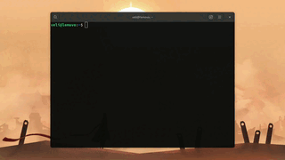

# Awesome Tiles 

Awesome Tiles is a tiling manager extension for GNOME Shell that makes it easy to move 
windows around with precision. It does that with reconfigurable keyboard shortcuts 
which are set to keys on the number pad by default.

## Features

* Tile windows in 9 different ways.
* Align windows to the center of a workspace.
* Configure keyboard shortcuts to your liking.
* Add a gap around tiled windows.

## Installation

### From GNOME Extensions (Recommended)

1. Go to <https://extensions.gnome.org/extension/4702/awesome-tiles/>
2. Install and Enable.

### From source code

You can install the extension by simply running `./install.sh local-install` after cloning
this repo and `cd`'ing into the cloned folder. 

## Credits

* [Useless Gaps](https://github.com/mipmip/gnome-shell-extensions-useless-gaps)
* [Night Theme Switcher](https://gitlab.com/rmnvgr/nightthemeswitcher-gnome-shell-extension) 

## Contributing

### Translation

Create a copy of `po/awesome-tiles@velitasali.com.pot` in the **same directory** and name it 
as follows:

* `<LANGUAGE_CODE>.po` for a language.
* `<LANGUAGE_CODE>_<COUNTRY_CODE>.po` for a language spoken in a specific region.

Examples:

* `ja.po` for the Japanese language translation.
* `de_AU.po` for the German language spoken in Austria.

Finally, open a new pull request that includes your translation.
